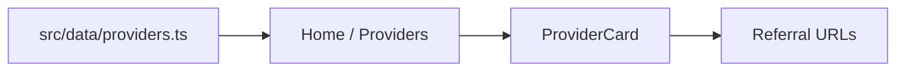

# Architecture

#freerouter #architecture

FreeRouter is a static-friendly **Next.js App Router** site that routes users to free AI providers via referral links.

## Why this shape

- **App Router** keeps pages as simple server components with client islands only where motion needs it.
- **No backend** — providers are a typed data module; deploy is zero-ops.
- **Referral hub** — every card is an external link; the product is curation + trust, not an API proxy.

## Data flow

1. [[Providers-Data]] lives in `src/data/providers.ts`.
2. Pages import the list and pass items to [[Components]].
3. Cards open `provider.url` in a new tab (`rel="noopener noreferrer"`).

## Routes

| Path | Role |
|------|------|
| `/` | Hero + top picks + single CTA |
| `/providers` | Full grid |
| `/about` | Two sentences max |

## Stack

- Next.js 16 (App Router) + React 19 + TypeScript
- Tailwind CSS v4
- Motion (`motion/react`) for reveals and FancyText
- Lucide icons
- Path alias `@/*` → `src/*`

## Related

- [[Components]]
- [[Animations]]
- [[Design-System]]
- [[Deployment]]
